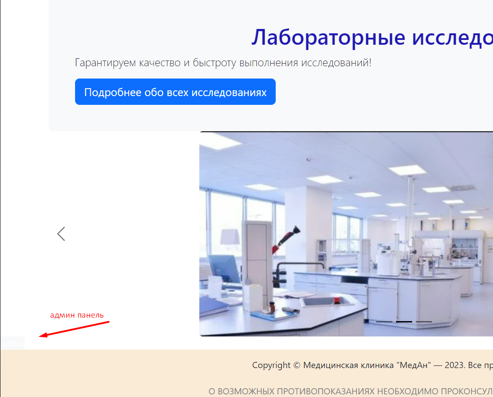

# Разработка веб-сайта для медицинской лаборатории с использованием Flask на языке Python (с админкой)

### Приложение предназначено для выбора медицинских исследований с получением итоговой суммы заказа
### Пользователи сервиса:
* неавторизованный пользователь (доступно только формирование "корзины"),
* авторизованный пользователь (доступно формирование "корзины", оформление заказа и доступ к личному кабинету),
* админ (возможность добавлять, редактировать исследования и удалять исследования, авторизованных пользователей и заказы).

### Для создания приложения использовали Flask c базой данных SQLite, HTML, CCS, Bootstrap5.
### Из Flask применили:
* модуль Sqlalchemy (для работы с базой данных),
* модуль Wtforms (для обработки html-форм),
* модуль Flask-Login (для работы с авторизованными пользователями)
* инструмент Blueprints (для реализации админ-панели),
* функцию get_flashed_messages (для обработки сформированных сообщений в шаблоне документа).

### База данных состоит из трёх таблиц

### 1. analyzes - таблица с исследованиями:
* номер (id)
* наименование исследования (name)
* цена исследования (price)
* дата создания исследования (created_date)

### 2. users - таблица с пользователями:
* номер (id)
* имя пользователя (name)
* фамилия пользователя (lastname)
* дата рождения (birthday)
* пол (gender)
* права доступа (level): пользователи=1, админ=2
* е-мэйл (email)
* пароль (hashed_password)
* дата регистрации пользователя (created_date)

### 3. orders - таблица с заказами
* номер (id)
* номер заказа (num_order)
* наименование исследования (name)
* цена исследования (price)
* дата создания заказа (created_date)
* номер пользователя (user_id)

### Перед началом работы необходимо установить зависимости: 
### pip install -r requirements.txt

### При запуске программ предложит перейти на страницу http://127.0.0.1:8000 переход, на которую открывает главную HTML-страницу:

## Возможности обычного пользователя
### Главная страница:
* Регистрация
* 
  #### Условия:
  * Почта (email): обязательно для заполнения, корректный формат почты, максимум 25 символов, не должен совпадать с уже существующими
  * Пароль: обязательно для заполнения, от 6 до 30 символов
  * Повтор пароля: обязательно для заполнения, максимум 30 символов, должен совпадать с паролем
  * Имя: обязательно для заполнения, от 2 до 25 символов
  * Фамилия: обязательно для заполнения, от 2 до 25 символов
  * Дата рождения: обязательно для заполнения, в формате "дд.мм.гг"

* Иконка корзины (для просмотра выбранных исследований), цифра показывает количество исследований в корзине
* 

* Поиск исследования
* 
    #### Условия:
    * ввод не больше 20 символов
  
* Лаб. исследования (просмотр всех исследований)
*  

### Страница "Лабораторные исследования":
* Добавление исследования в корзину --> Корзина
* 

### Страница "Корзина":
* Добавление исследования
* Удаление определённого исследования
* Удаление всех исследований сразу
* Авторизация
* 

  
## Возможности авторизированного пользователя
### Аналогичные, что и у обычного пользователя
### Новые
### Главная страница:
* Войти (если зарегистрированный)
* 
   #### Условия:
   * логин: обязательное поле, корректный формат, максимум 25 символов
   * пароль: обязательное поле, от 6 до 30 символов
   * логин и пароль должны соответствовать друг другу

* Надпись "Имя пользователя": Личный кабинет и Выйти
* 

### Страница "Корзина":
* Оформление заказа --> Информация о заказе с возможностью перейти в Личный кабинет
* 

### Страница "Ваш заказ":
* * 

### Личный кабинет:
* Информация о всех заказах пользователя
* 

## Возможности админа
### Аналогичные, что и у авторизированного пользователя
### Основные новые

### Для входа
* логин: admin@email.ru
* пароль: 123456

### Вход в админку в углу слева над "подавлом"

### Панель администратора (все страницы с пагинацией)

* ### Исследования:
  + #### Просмотр всех исследований
  + 
  + #### Добавление нового исследования
  + 
  
     #### условия:
     * наименование исследования: обязательно для заполнения, не должно превышать 50 символов, не должно совпадать с существующими
     * цена исследования: обязательно для заполнения, число больше 0, меньше 1000000
  
  + #### Редактирование исследования
  + 
  
     #### условия:
     * наименование исследования: обязательно для заполнения, не должно превышать 50 символов
     * цена исследования: обязательно для заполнения, число больше 0, меньше 1000000
  + удаление исследования

* ### Заказы:
  + #### Просмотр всех заказов
  + 
  
  + #### Просмотр исследований определённого заказа (для этого в поисковике нужно набрать номер заказа)
  + 
  + 
  
  + #### Удаление заказа

* ### Пользователи:
  + #### Просмотр всех пользователей
  + #### Удаление пользователя
  + 
