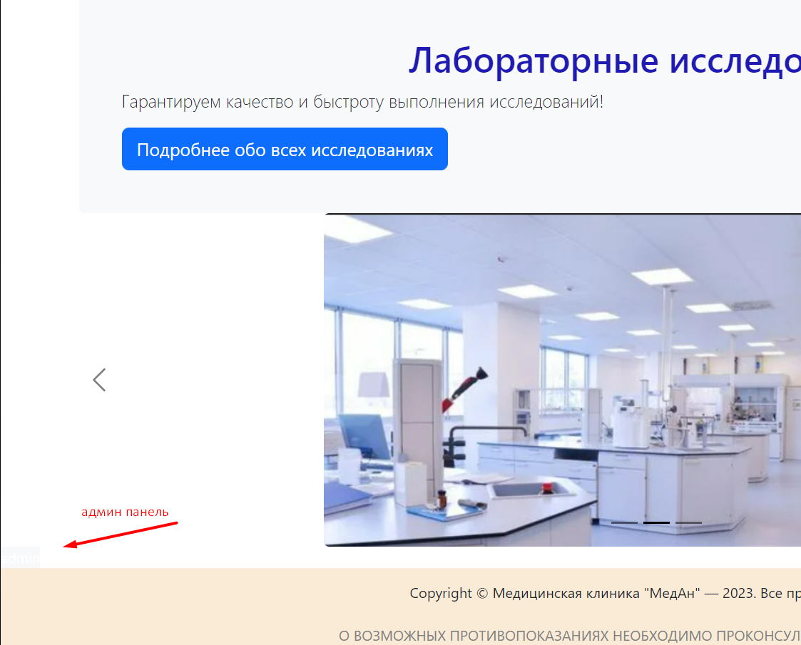

# REDME.md ещё в работе
# Сайт для заказа медицинских исследований
## Для входа
### Админ
* логин: admin@email.ru
* пароль: 123456
### Авторизованные пользователи
* логины: от user1@email.ru до user12@email.ru
* пароли у всех: 123456
## Возможности обычного пользователя
### Главная страница:
* Регистрация
* Войти (если зарегистрированный)
* Иконка корзины (для просмотра выбранных исследований), цифра показывает количество исследований в корзине
* Поиск исследования
* Выбор исследования --> Лабораторные исследования
### Страница "Лабораторные исследования":
* Добавление исследования в корзину --> Корзина
* Внизу справа кнопка, чтобы подняться на начало страницы
### Страница "Корзина":
* Добавление исследования
* Удаление определённого исследования
* Удаление всех исследований сразу
* Авторизоваться

## Возможности авторизированного пользователя
### Аналогичные, что и у обычного пользователя
### Новые
### Главная страница:
* В меню Имя пользователя: Личный кабинет и Выйти
### Личный кабинет:
* Информация о всех заказах
### Страница "Корзина":
* Оформление заказа --> Информация о заказе с возможностью перейти в Личный кабинет

## Возможности админа
### Аналогичные, что и у авторизированного пользователя
### Основные новые
### Вход в админку в углу слева над "подавлом"

### Панель администратора (все страницы с пагинацией)
* Исследования:
  + просмотр
  + добавление
  + редактирование
  + удаление
* Заказы:
  + просмотр всех заказов
  + просмотр исследований определённого заказа (для этого в поисковике нужно набрать номер заказа)
  + удаление
* Пользователи:
  + просмотр
  + удаление
